<div align="center">

# 📚 StudyHub

### An AI-powered mobile learning platform built with Flutter & Laravel

[](https://flutter.dev)
[](https://dart.dev)
[](https://laravel.com)
[](https://php.net)

[Features](#-features) · [Screenshots](#-screenshots) · [Tech Stack](#-tech-stack) · [Getting Started](#-getting-started) · [API Docs](#-api-reference) · [Folder Structure](#-folder-structure)

</div>

---

## 🎯 Overview

StudyHub is a full-stack mobile learning platform that connects students with structured courses, real-time AI tutoring, and a seamless video learning experience — all in one app.

Built as a complete Flutter + Laravel application, it demonstrates end-to-end mobile product development: custom REST API design, JWT-based authentication, AI integration, and a polished multi-screen mobile UI.

---

## ✨ Features

- 🔐 **Authentication** — Secure login & registration with JWT token-based sessions
- 🏠 **Personalised Home Feed** — Dynamic course recommendations based on user activity
- 🔍 **Course Search** — Real-time search with filters by category, rating, and duration
- 📚 **Course Catalogue** — Browse courses with detailed previews, instructor info, and reviews
- 🎬 **Video Player** — In-app course video playback with progress tracking
- 🤖 **AI Tutor** — Integrated AI assistant for contextual doubt-solving within courses
- 👤 **User Profile** — Enrolled courses, completed lessons, and account management
- 🌐 **Laravel REST API** — Clean API backend with structured JSON responses

---

## 📱 Screenshots

### Onboarding

<table>
  <tr>
    <td align="center"><b>Splash Screen</b></td>
    <td align="center"><b>Intro 1</b></td>
    <td align="center"><b>Intro 2</b></td>
  </tr>
  <tr>
    <td>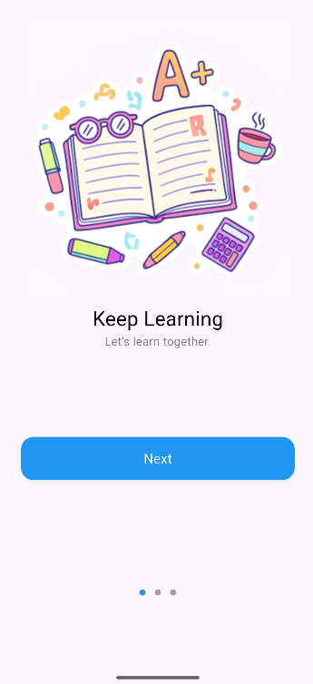</td>
    <td></td>
    <td>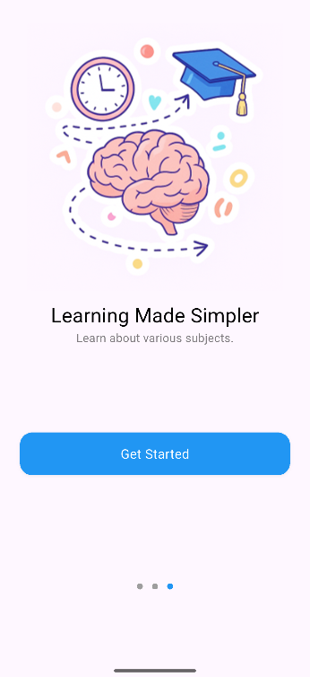</td>
  </tr>
</table>

### Authentication

<table>
  <tr>
    <td align="center"><b>Login</b></td>
    <td align="center"><b>Register</b></td>
  </tr>
  <tr>
    <td>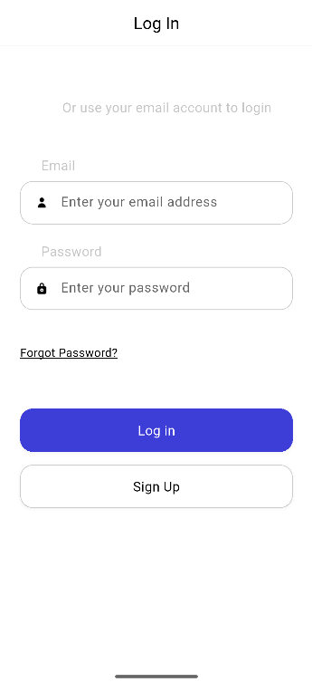</td>
    <td>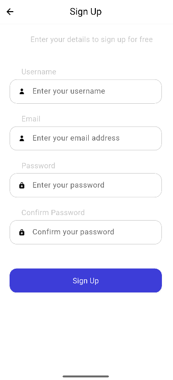</td>
  </tr>
</table>

### Core Screens

<table>
  <tr>
    <td align="center"><b>Home</b></td>
    <td align="center"><b>Search</b></td>
    <td align="center"><b>Courses</b></td>
  </tr>
  <tr>
    <td>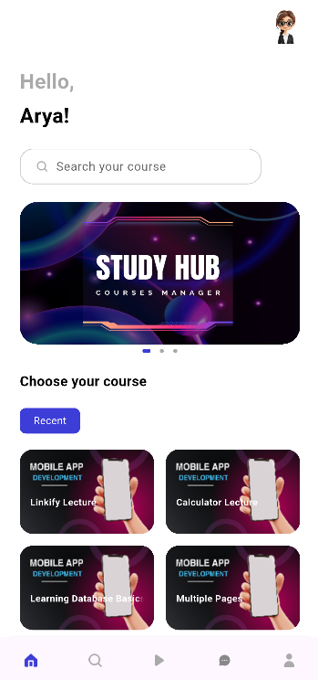</td>
    <td>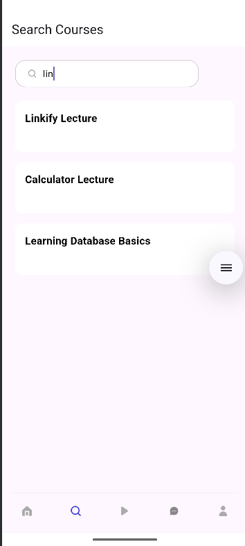</td>
    <td>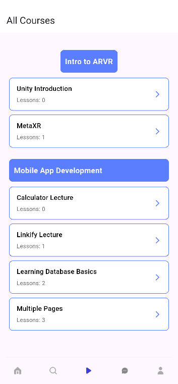</td>
  </tr>
</table>

### Learning Experience

<table>
  <tr>
    <td align="center"><b>Course Detail</b></td>
    <td align="center"><b>Course Player</b></td>
    <td align="center"><b>AI Tutor</b></td>
  </tr>
  <tr>
    <td>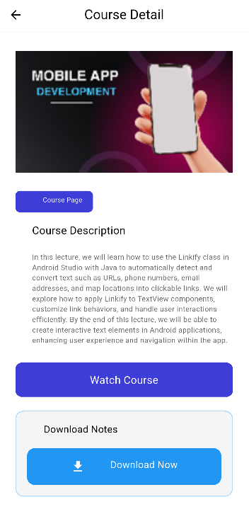</td>
    <td>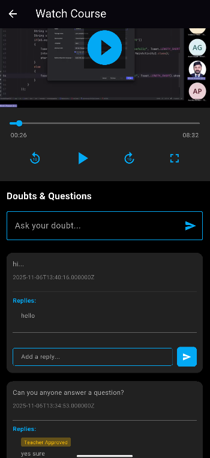</td>
    <td>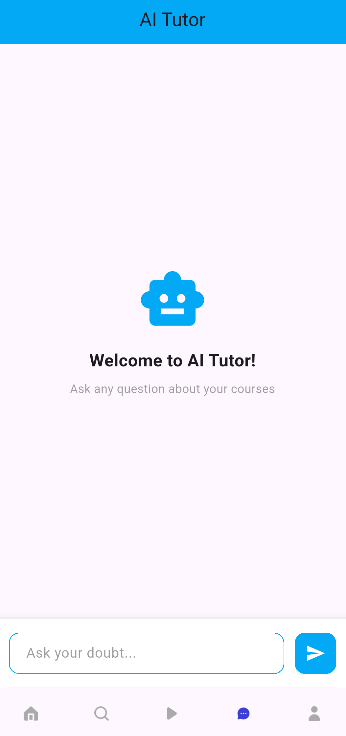</td>
  </tr>
</table>

### Profile

<table>
  <tr>
    <td align="center"><b>User Profile</b></td>
  </tr>
  <tr>
    <td>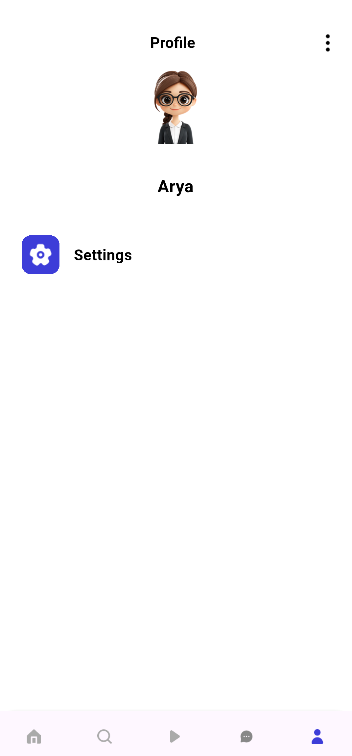</td>
  </tr>
</table>

---

## 🛠 Tech Stack

### Frontend — `frontend/`
| Layer | Technology |
|---|---|
| Framework | Flutter 3.x |
| Language | Dart |
| State Management | Provider / GetX |
| HTTP Client | Dio |
| Local Storage | SharedPreferences |
| Video Playback | video_player |
| Navigation | Go Router |

### Backend — `backend/`
| Layer | Technology |
|---|---|
| Framework | Laravel 10 |
| Language | PHP 8.x |
| Authentication | Laravel Sanctum / JWT |
| Database | MySQL |
| API Style | RESTful JSON API |

---

## 📁 Folder Structure

```
StudyHub/
├── frontend/                   # Flutter mobile app
│   ├── lib/
│   │   ├── main.dart
│   │   ├── screens/
│   │   │   ├── auth/           # Login, Register
│   │   │   ├── home/           # Home feed
│   │   │   ├── search/         # Course search
│   │   │   ├── courses/        # Course list, detail, player
│   │   │   ├── ai_tutor/       # AI Tutor screen
│   │   │   └── profile/        # User profile
│   │   ├── widgets/            # Reusable UI components
│   │   ├── models/             # Data models
│   │   ├── services/           # API service layer
│   │   └── utils/              # Constants, helpers, theme
│   └── pubspec.yaml
│
├── backend/                    # Laravel REST API
│   ├── app/
│   │   ├── Http/Controllers/   # API controllers
│   │   ├── Models/             # Eloquent models
│   │   └── Services/           # Business logic
│   ├── routes/
│   │   └── api.php             # API route definitions
│   ├── database/
│   │   └── migrations/         # DB schema
│   └── .env.example
│
└── README.md
```

---

## 🚀 Getting Started

### Prerequisites

- Flutter SDK `>=3.0.0`
- Dart SDK `>=3.0.0`
- PHP `>=8.1`
- Composer
- MySQL

---

### Frontend Setup

```bash
cd frontend
flutter pub get
flutter run
```

To configure the API base URL, update `lib/utils/constants.dart`:

```dart
const String baseUrl = 'http://your-api-url/api';
```

#### Run on a physical device or emulator over local network

> When testing on a real Android device, `localhost` won't work — use your machine's local IP instead.

```bash
# 1. Find your machine's local IP (Windows)
ipconfig
# Look for "IPv4 Address" e.g. 192.168.1.5

# 2. Update baseUrl in constants.dart
const String baseUrl = 'http://192.168.1.5:8000/api';

# 3. Make sure Laravel is serving on that IP (see backend section below)
```

#### Build a release APK

```bash
cd frontend

# Clean previous build artifacts
flutter clean

# Reinstall dependencies
flutter pub get

# Build release APK
flutter build apk --release
```

The compiled APK will be available at:

```
build/app/outputs/flutter-apk/release/app-release.apk
```

> You can share this `.apk` directly or install it on any Android device with "Install from unknown sources" enabled.

---

### Backend Setup

```bash
cd backend
composer install
cp .env.example .env
php artisan key:generate
```

Update `.env` with your database credentials:

```env
DB_DATABASE=studyhub
DB_USERNAME=root
DB_PASSWORD=your_password
```

Then run migrations and start the server:

```bash
php artisan migrate --seed

# Start server on localhost only
php artisan serve

# OR — expose to your local network (required for physical device testing)
php artisan serve --host=your_ip_address --port=8000
# e.g. php artisan serve --host=192.168.1.5 --port=8000
```

API will be available at:
- **Emulator:** `http://10.0.2.2:8000/api`
- **Physical device:** `http://192.168.1.5:8000/api` *(replace with your actual IP)*

---

## 📡 API Reference

| Method | Endpoint | Description | Auth |
|---|---|---|---|
| `POST` | `/api/register` | Register new user | ❌ |
| `POST` | `/api/login` | Login & get token | ❌ |
| `GET` | `/api/courses` | List all courses | ✅ |
| `GET` | `/api/courses/{id}` | Course detail | ✅ |
| `GET` | `/api/courses/{id}/lessons` | Course lessons | ✅ |
| `POST` | `/api/courses/{id}/enroll` | Enroll in course | ✅ |
| `GET` | `/api/search?q={query}` | Search courses | ✅ |
| `GET` | `/api/profile` | Get user profile | ✅ |
| `POST` | `/api/ai-tutor` | Query AI tutor | ✅ |

> ✅ = Requires Bearer token in `Authorization` header

---

## 🗺 Roadmap

- [ ] Admin Panel Adds Courses
- [ ] User Registers and Logins
- [ ] Search Preferred Courses
- [ ] Watch Courses
- [ ] Download Notes

---

## 👨‍💻 Author

**Arya Lunawat** <br>
MBA Tech | NMIMS Indore

[](https://github.com/arya-lunawat)

---

<div align="center">
  <sub>Built with Flutter and Laravel</sub>
</div>
